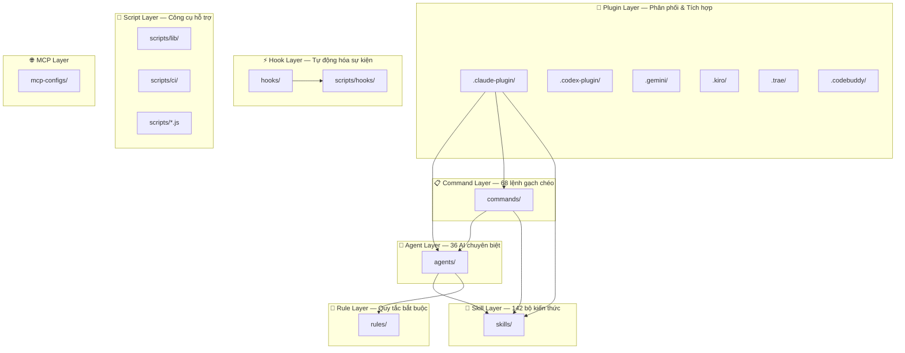
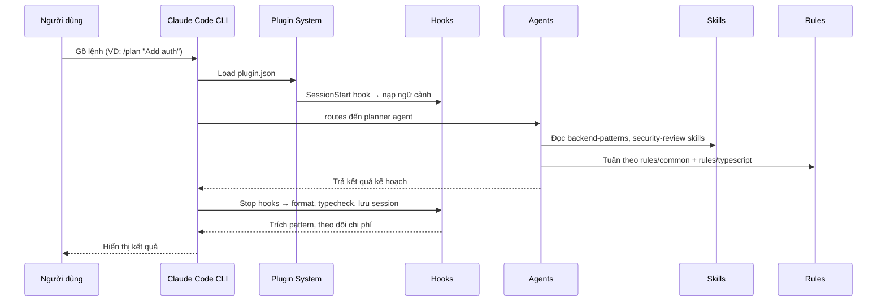

# Everything Claude Code (ECC) — Kiến trúc dự án chi tiết

> **Phiên bản:** 1.9.0 | **Giấy phép:** MIT | **Tác giả:** Affaan Mustafa

## Sơ đồ tổng quan

---

## Mô tả chi tiết từng thư mục & file

---

### 1. `.claude-plugin/` — Plugin manifest cho Claude Code

| File | Mô tả |
|------|--------|
| `plugin.json` | **Manifest chính** — khai báo tên, version, danh sách agents, skills, commands để Claude Code CLI tự động load |
| `marketplace.json` | Cấu hình marketplace — cho phép dùng lệnh `/plugin marketplace add` |
| `README.md` | Hướng dẫn sử dụng plugin |
| `PLUGIN_SCHEMA_NOTES.md` | Ghi chú về schema plugin, giải thích cách Claude Code phân tích cú pháp |

> [!NOTE]
> Đây là "cánh cổng" chính để Claude Code CLI nhận diện và nạp toàn bộ hệ thống ECC. Khi cài plugin, Claude đọc `plugin.json` rồi lần theo đường dẫn để load agents, skills, commands.

---

### 2. `.codex-plugin/` — Plugin manifest cho OpenAI Codex

| File | Mô tả |
|------|--------|
| `plugin.json` | Manifest để Codex nhận ECC như một plugin |
| `README.md` | Hướng dẫn cài đặt cho Codex |

---

### 3. `.codex/` — Cấu hình native cho Codex CLI

| File | Mô tả |
|------|--------|
| `AGENTS.md` | File hướng dẫn tổng thể cho Codex (tương đương `CLAUDE.md`) |
| `agents/` | Thư mục agents format riêng cho Codex |
| `config.toml` | Cấu hình TOML cho Codex CLI |

---

### 4. `.cursor/` — Cấu hình cho Cursor IDE

| Nội dung | Mô tả |
|----------|--------|
| `hooks/`, `hooks.json` | Hook tự động hóa format riêng cho Cursor |
| `rules/` | Rules được chuyển đổi sang format Cursor |
| `skills/` | Skills cho Cursor |

---

### 5. `.opencode/` — Cấu hình cho OpenCode

| File | Mô tả |
|------|--------|
| `opencode.json` | Manifest chính cho OpenCode — khai báo agents, commands, hooks, plugins, tools |
| `index.ts` | Entry point TypeScript cho plugin OpenCode |
| `package.json` | Dependencies riêng của module OpenCode |
| `commands/` | Slash commands dạng OpenCode |
| `instructions/` | Hướng dẫn hệ thống cho OpenCode |
| `plugins/` | Plugin adapters |
| `prompts/` | System prompts |
| `tools/` | Custom tools (run-tests, check-coverage, security-audit) |
| `MIGRATION.md` | Hướng dẫn chuyển đổi từ Claude Code sang OpenCode |

---

### 6. `.gemini/` — Cấu hình cho Gemini/Antigravity IDE

| File | Mô tả |
|------|--------|
| `GEMINI.md` | Hướng dẫn hệ thống dành cho Gemini — tương đương `CLAUDE.md` |

---

### 7. `.kiro/` — Cấu hình cho Kiro IDE

Chứa agents, docs, hooks, scripts, settings, skills, steering — port đầy đủ hệ thống ECC cho Kiro.

---

### 8. `.trae/` — Cấu hình cho Trae IDE

Chứa scripts cài đặt (install/uninstall cho cả bash và Node.js), README tiếng Anh và tiếng Trung.

---

### 9. `.codebuddy/` — Cấu hình cho CodeBuddy IDE

Chứa scripts cài đặt (install/uninstall cho cả bash và Node.js).

---

### 10. `.agents/` — Agent nội bộ bổ sung

| Thư mục con | Mô tả |
|-------------|--------|
| `plugins/` | Plugin marketplace nội bộ |
| `skills/` | Skills dạng `.agents` format (dùng cho một số IDE khác) |

---

### 11. `.claude/` — Cấu hình cục bộ của project

| File/Folder | Mô tả |
|-------------|--------|
| `commands/` | Thư mục lệnh cục bộ dùng nội bộ trong project này |
| `rules/` | Rules cục bộ chỉ áp dụng cho repo ECC |
| `skills/` | Skills cục bộ |
| `identity.json` | Thông tin định danh project |
| `package-manager.json` | Lock file chỉ định package manager (yarn) |
| `ecc-tools.json` | Config cho ECC Tools GitHub App |
| `enterprise/` | Config cho cấp enterprise |
| `homunculus/` | Module thử nghiệm (internal) |
| `research/` | Ghi chú nghiên cứu nội bộ |
| `team/` | Config nhóm phát triển |

---

## Các thư mục lõi (Core Directories)

---

### 12. `agents/` — 36 Agent chuyên biệt

Mỗi file `.md` là định nghĩa một AI subagent với YAML frontmatter (`name`, `description`, `tools`, `model`).

| Nhóm | Agents | Chức năng |
|------|--------|-----------|
| **Lập kế hoạch** | `planner.md`, `architect.md` | Phân tích yêu cầu, thiết kế hệ thống |
| **Code review** | `code-reviewer.md`, `typescript-reviewer.md`, `python-reviewer.md`, `go-reviewer.md`, `rust-reviewer.md`, `java-reviewer.md`, `kotlin-reviewer.md`, `cpp-reviewer.md`, `flutter-reviewer.md` | Review code theo từng ngôn ngữ |
| **Build & Fix** | `build-error-resolver.md`, `go-build-resolver.md`, `rust-build-resolver.md`, `java-build-resolver.md`, `kotlin-build-resolver.md`, `cpp-build-resolver.md`, `pytorch-build-resolver.md` | Xử lý lỗi build cho từng ecosystem |
| **Testing** | `tdd-guide.md`, `e2e-runner.md` | Hướng dẫn TDD, chạy Playwright E2E |
| **Bảo mật** | `security-reviewer.md` | Quét lỗ hổng bảo mật |
| **Docs & Cleanup** | `doc-updater.md`, `docs-lookup.md`, `refactor-cleaner.md` | Cập nhật tài liệu, xóa code rác |
| **Vận hành** | `loop-operator.md`, `harness-optimizer.md`, `chief-of-staff.md` | Điều phối loop tự trị, tối ưu harness, quản lý liên lạc |
| **Chuyên biệt** | `database-reviewer.md`, `performance-optimizer.md`, `healthcare-reviewer.md` | Database, hiệu suất, y tế |
| **Open Source** | `opensource-forker.md`, `opensource-packager.md`, `opensource-sanitizer.md` | Fork, đóng gói, làm sạch repo mã nguồn mở |
| **GAN** | `gan-planner.md`, `gan-generator.md`, `gan-evaluator.md` | Lập kế hoạch, sinh, đánh giá kiến trúc kiểu GAN |

---

### 13. `commands/` — 68 Slash Commands

Mỗi file `.md` định nghĩa một lệnh `/tên-lệnh` mà người dùng gõ trong Claude Code.

| Nhóm | Lệnh tiêu biểu | Mô tả |
|------|----------------|--------|
| **Dev workflow** | `/plan`, `/tdd`, `/code-review`, `/build-fix`, `/refactor-clean` | Lập kế hoạch → Code → Review → Sửa lỗi → Dọn dẹp |
| **Testing** | `/e2e`, `/test-coverage`, `/verify` | Kiểm thử E2E, phân tích độ phủ, vòng lặp xác minh |
| **Learning** | `/learn`, `/learn-eval`, `/evolve`, `/prune` | Trích xuất pattern, tiến hóa instinct thành skill |
| **Instinct** | `/instinct-status`, `/instinct-import`, `/instinct-export` | Quản lý bản năng đã học |
| **Multi-agent** | `/multi-plan`, `/multi-execute`, `/multi-backend`, `/multi-frontend`, `/multi-workflow` | Phối hợp nhiều agent/service song song |
| **Session** | `/sessions`, `/save-session`, `/resume-session` | Quản lý phiên làm việc |
| **Orchestration** | `/orchestrate`, `/pm2`, `/loop-start`, `/loop-status` | Điều phối, quản lý dịch vụ, vòng lặp tự trị |
| **Ngôn ngữ** | `/go-review`, `/go-test`, `/go-build`, `/python-review`, `/rust-review`, `/rust-build`, `/rust-test`, `/cpp-review`, `/cpp-test`, `/cpp-build`, `/kotlin-review`, `/kotlin-test`, `/kotlin-build` | Lệnh chuyên biệt cho từng ngôn ngữ |
| **Utility** | `/setup-pm`, `/skill-create`, `/skill-health`, `/harness-audit`, `/model-route`, `/quality-gate`, `/docs`, `/update-docs`, `/update-codemaps` | Tiện ích cài đặt, kiểm tra sức khỏe, tài liệu |
| **GAN / PRP** | `/gan-build`, `/gan-design`, `/prp-plan`, `/prp-implement`, `/prp-commit`, `/prp-pr`, `/prp-prd` | Luồng phát triển theo mô hình GAN và PRP |
| **Khác** | `/claw`, `/prompt-optimize`, `/context-budget`, `/rules-distill`, `/aside`, `/devfleet`, `/projects`, `/promote`, `/santa-loop` | NanoClaw REPL, tối ưu prompt, ngân sách context, và các tiện ích đặc biệt |

---

### 14. `skills/` — 142 Bộ kiến thức (Skill)

Mỗi thư mục con chứa một `SKILL.md` mô tả workflow/kiến thức chuyên sâu. Được phân nhóm:

| Nhóm | Skills | Mô tả |
|------|--------|--------|
| **Coding Standards** | `coding-standards/`, `java-coding-standards/`, `cpp-coding-standards/` | Tiêu chuẩn code cho từng ngôn ngữ |
| **Backend** | `backend-patterns/`, `api-design/`, `postgres-patterns/`, `jpa-patterns/`, `database-migrations/` | Kiến trúc backend, thiết kế API, database |
| **Frontend** | `frontend-patterns/`, `frontend-slides/`, `design-system/`, `liquid-glass-design/` | React/Next.js patterns, tạo slide HTML, hệ thống thiết kế |
| **Framework-specific** | `django-*` (4 skills), `laravel-*` (5 skills), `springboot-*` (4 skills), `kotlin-*` (5 skills), `nuxt4-patterns/` | Pattern, security, TDD, verification cho từng framework |
| **Ngôn ngữ** | `golang-*` (2), `python-*` (2), `rust-*` (2), `cpp-*` (2), `perl-*` (3), `swift-*` (3), `pytorch-patterns/` | Testing, patterns cho từng ngôn ngữ |
| **Testing & Quality** | `tdd-workflow/`, `e2e-testing/`, `verification-loop/`, `eval-harness/`, `plankton-code-quality/` | TDD, E2E, verification, evaluation |
| **Security** | `security-review/`, `security-scan/`, `safety-guard/` | Checklist bảo mật, quét AgentShield |
| **Learning** | `continuous-learning/`, `continuous-learning-v2/`, `iterative-retrieval/`, `strategic-compact/` | Học liên tục, nén ngữ cảnh thông minh |
| **Content** | `article-writing/`, `content-engine/`, `crosspost/`, `x-api/`, `market-research/`, `investor-materials/`, `investor-outreach/` | Viết bài, nội dung đa nền tảng, nghiên cứu thị trường |
| **DevOps** | `deployment-patterns/`, `docker-patterns/`, `dmux-workflows/`, `autonomous-loops/` | CI/CD, Docker, orchestration đa agent |
| **AI/ML** | `claude-api/`, `fal-ai-media/`, `exa-search/`, `deep-research/`, `documentation-lookup/`, `cost-aware-llm-pipeline/` | Tích hợp API AI, tạo media, tìm kiếm, nghiên cứu |
| **Video** | `video-editing/`, `videodb/`, `remotion-video-creation/` | Chỉnh sửa video, tạo video bằng code |
| **Mobile** | `android-clean-architecture/`, `compose-multiplatform-patterns/`, `flutter-dart-code-review/`, `swiftui-patterns/`, `foundation-models-on-device/` | Android, Flutter, SwiftUI, on-device AI |
| **Architecture** | `hexagonal-architecture/`, `architecture-decision-records/`, `mcp-server-patterns/` | Kiến trúc hexagonal, ADR, xây MCP server |
| **Agent/Harness** | `autonomous-agent-harness/`, `agent-harness-construction/`, `agent-eval/`, `enterprise-agent-ops/`, `continuous-agent-loop/`, `gan-style-harness/`, `santa-method/`, `team-builder/` | Xây dựng và vận hành bộ harness cho AI agent |
| **Business Domain** | `healthcare-*` (4 skills), `customs-trade-compliance/`, `energy-procurement/`, `logistics-exception-management/`, `carrier-relationship-management/`, `inventory-demand-planning/`, `production-scheduling/`, `quality-nonconformance/`, `returns-reverse-logistics/`, `lead-intelligence/` | Các skill cho ngành y tế, logistics, sản xuất, năng lượng |
| **Utility** | `configure-ecc/`, `skill-stocktake/`, `skill-comply/`, `repo-scan/`, `codebase-onboarding/`, `browser-qa/`, `click-path-audit/`, `canary-watch/`, `data-scraper-agent/`, `prompt-optimizer/`, `token-budget-advisor/`, `context-budget/` | Cài đặt, kiểm tra, scraping, tối ưu prompt, quản lý token |

---

### 15. `rules/` — Quy tắc bắt buộc (13 ngôn ngữ)

Tổ chức theo thư mục ngôn ngữ. Mỗi thư mục chứa các file `.md` quy định quy tắc AI phải tuân theo.

| Thư mục | Nội dung |
|---------|----------|
| `common/` | **10 file quy tắc chung** — `coding-style.md`, `testing.md`, `security.md`, `git-workflow.md`, `performance.md`, `patterns.md`, `hooks.md`, `agents.md`, `code-review.md`, `development-workflow.md` |
| `typescript/` | Quy tắc cho TypeScript/JavaScript |
| `python/` | Quy tắc cho Python |
| `golang/` | Quy tắc cho Go |
| `java/` | Quy tắc cho Java |
| `kotlin/` | Quy tắc cho Kotlin/Android |
| `rust/` | Quy tắc cho Rust |
| `cpp/` | Quy tắc cho C++ |
| `swift/` | Quy tắc cho Swift |
| `php/` | Quy tắc cho PHP |
| `perl/` | Quy tắc cho Perl |
| `csharp/` | Quy tắc cho C# |
| `zh/` | Bản dịch tiếng Trung |

---

### 16. `hooks/` — Hệ thống Hook tự động hóa

| File | Mô tả |
|------|--------|
| `hooks.json` | **Config chính 353 dòng** — Định nghĩa toàn bộ hook theo 6 sự kiện vòng đời |
| `README.md` | Tài liệu hướng dẫn hook |

#### 6 Loại sự kiện Hook:

| Sự kiện | Mục đích | Số hook |
|---------|----------|---------|
| **`PreToolUse`** | Chạy TRƯỚC khi AI dùng tool | 12 hooks — chặn `--no-verify`, nhắc tmux, kiểm tra quality commit, bảo vệ config, MCP health check, bảo mật InsAIts, governance capture |
| **`PostToolUse`** | Chạy SAU khi AI dùng tool xong | 9 hooks — ghi log bash, theo dõi chi phí, cảnh báo console.log, kiểm tra quality gate, tích lũy file đã chỉnh sửa, capture governance |
| **`PostToolUseFailure`** | Chạy khi tool thất bại | 1 hook — theo dõi MCP server lỗi, tự động reconnect |
| **`PreCompact`** | Chạy trước khi nén ngữ cảnh | 1 hook — lưu trạng thái trước compaction |
| **`SessionStart`** | Chạy khi bắt đầu phiên mới | 1 hook — nạp lại ngữ cảnh phiên trước, phát hiện package manager |
| **`Stop`** | Chạy khi AI trả lời xong | 6 hooks — Batch format+typecheck, kiểm tra console.log, lưu session, trích pattern, theo dõi chi phí, gửi thông báo desktop |
| **`SessionEnd`** | Chạy khi kết thúc phiên | 1 hook — đánh dấu kết thúc session |

---

### 17. `scripts/` — Hệ thống script (Node.js + Shell)

#### `scripts/hooks/` — 34 script triển khai hook

Mỗi file `.js` là logic thực thi của một hook cụ thể:

| Script | Chức năng |
|--------|-----------|
| `session-start-bootstrap.js` | Nạp ngữ cảnh khi khởi tạo phiên |
| `session-start.js` / `session-end.js` | Quản lý vòng đời phiên chi tiết |
| `run-with-flags.js` | **Router trung tâm** — kiểm tra `ECC_HOOK_PROFILE` và `ECC_DISABLED_HOOKS` trước khi chạy hook con |
| `pre-bash-commit-quality.js` | Kiểm tra chất lượng trước commit (lint, format, secrets) |
| `config-protection.js` | Chặn AI sửa file config linter/formatter |
| `stop-format-typecheck.js` | Batch chạy Biome/Prettier + tsc sau mỗi response |
| `quality-gate.js` | Cổng chất lượng tự động |
| `mcp-health-check.js` | Kiểm tra sức khỏe MCP server |
| `governance-capture.js` | Bắt sự kiện governance (secrets, vi phạm chính sách) |
| `cost-tracker.js` | Theo dõi chi phí token |
| `desktop-notify.js` | Gửi thông báo desktop khi AI trả lời xong |
| `suggest-compact.js` | Gợi ý nén ngữ cảnh thông minh |
| `evaluate-session.js` | Trích xuất pattern từ phiên làm việc |
| `insaits-security-wrapper.js` | Wrapper cho bảo mật InsAIts |

#### `scripts/lib/` — 21+ file thư viện lõi

| File | Chức năng |
|------|-----------|
| `utils.js` / `utils.d.ts` | Tiện ích file/path/system đa nền tảng (18KB) |
| `package-manager.js` / `.d.ts` | Phát hiện và chọn package manager (npm/pnpm/yarn/bun) |
| `install-lifecycle.js` | Quản lý vòng đời cài đặt (34KB — file lớn nhất) |
| `install-executor.js` | Thực thi pipeline cài đặt |
| `install-manifests.js` | Đọc và xử lý manifest cài đặt |
| `install-state.js` | Quản lý trạng thái đã cài |
| `session-manager.js` / `.d.ts` | Quản lý phiên làm việc |
| `session-aliases.js` / `.d.ts` | Alias và tra cứu phiên |
| `project-detect.js` | Phát hiện loại project (ngôn ngữ, framework) |
| `resolve-ecc-root.js` | Tìm thư mục gốc ECC |
| `resolve-formatter.js` | Phát hiện formatter (Biome/Prettier/ESLint) |
| `tmux-worktree-orchestrator.js` | Điều phối tmux + git worktree cho multi-agent |
| `orchestration-session.js` | Quản lý phiên orchestration |
| `agent-compress.js` | Nén ngữ cảnh agent |
| `hook-flags.js` | Xử lý cờ hook (profile, disabled) |
| `inspection.js` | Công cụ kiểm tra hệ thống |
| `install-targets/` | Adapter cài đặt cho từng target (Claude, Cursor, Gemini...) |
| `session-adapters/` | Adapter phiên cho từng harness |
| `state-store/` | SQLite state store |
| `skill-evolution/` | Cơ sở hạ tầng tiến hóa skill |
| `skill-improvement/` | Pipeline cải thiện skill |

#### `scripts/ci/` — 9 script CI/CD

| Script | Chức năng |
|--------|-----------|
| `catalog.js` | Sinh danh mục (catalog) tất cả agents, skills, commands, hooks, rules |
| `check-unicode-safety.js` | Phát hiện ký tự Unicode nguy hiểm |
| `validate-agents.js` | Kiểm tra format của tất cả agent files |
| `validate-commands.js` | Kiểm tra format của tất cả command files |
| `validate-hooks.js` | Kiểm tra cấu trúc hooks.json |
| `validate-rules.js` | Kiểm tra format rules |
| `validate-skills.js` | Kiểm tra format skills |
| `validate-install-manifests.js` | Kiểm tra manifest cài đặt |
| `validate-no-personal-paths.js` | Phát hiện đường dẫn cá nhân bị lẫn vào |

#### Các script chính khác:

| Script | Chức năng |
|--------|-----------|
| `ecc.js` | **CLI chính** — entry point lệnh `npx ecc` |
| `install-plan.js` | Lập kế hoạch cài đặt (selective install) |
| `install-apply.js` | Thực thi cài đặt — entry point `npx ecc-install` |
| `claw.js` | **NanoClaw v2** — REPL mini với model routing, skill hot-load, session management |
| `doctor.js` | Chẩn đoán cài đặt ECC |
| `harness-audit.js` | Chấm điểm và kiểm tra cấu hình harness (24KB) |
| `status.js` | Hiển thị trạng thái hệ thống ECC |
| `sessions-cli.js` | CLI quản lý session |
| `session-inspect.js` | Kiểm tra chi tiết một session |
| `skill-create-output.js` | Sinh output cho lệnh `/skill-create` |
| `skills-health.js` | Kiểm tra sức khỏe skills |
| `repair.js` | Sửa chữa cấu hình bị hỏng |
| `uninstall.js` | Gỡ cài đặt ECC |
| `setup-package-manager.js` | Cài đặt package manager |
| `orchestrate-worktrees.js` | Điều phối git worktree cho multi-agent |
| `orchestration-status.js` | Trạng thái orchestration |
| `catalog.js` | Sinh catalog tổng thể |

---

### 18. `tests/` — Bộ kiểm thử

| File/Folder | Mô tả |
|-------------|--------|
| `run-all.js` | Runner chạy tất cả test |
| `lib/` | Tests cho `scripts/lib/` (utils, package-manager, v.v.) |
| `hooks/` | Tests cho hooks |
| `ci/` | Tests cho CI scripts |
| `integration/` | Integration tests |
| `scripts/` | Tests cho scripts |
| `plugin-manifest.test.js` | Test plugin manifest (10KB — kiểm tra kỹ cấu trúc plugin) |
| `codex-config.test.js` | Test cấu hình Codex |
| `opencode-config.test.js` | Test cấu hình OpenCode |

---

### 19. `schemas/` — JSON Schema (10 file)

| Schema | Mô tả |
|--------|--------|
| `hooks.schema.json` | Schema chuẩn cho hooks.json |
| `plugin.schema.json` | Schema cho plugin.json |
| `state-store.schema.json` | Schema cho SQLite state store (7KB) |
| `install-*.schema.json` | Schemas cho hệ thống cài đặt (components, modules, profiles, state, config) |
| `package-manager.schema.json` | Schema cho config package manager |
| `provenance.schema.json` | Schema cho thông tin nguồn gốc |

---

### 20. `manifests/` — Install Manifests

| File | Mô tả |
|------|--------|
| `install-components.json` | Danh sách tất cả component có thể cài (11KB) |
| `install-modules.json` | Nhóm components thành modules (13KB) |
| `install-profiles.json` | Profiles cài đặt (minimal, standard, full) |

> [!IMPORTANT]
> Đây là cốt lõi của kiến trúc **Selective Install** (v1.9.0) — cho phép người dùng chỉ cài những module cần thiết thay vì toàn bộ.

---

### 21. `contexts/` — Ngữ cảnh động

| File | Mô tả |
|------|--------|
| `dev.md` | Inject khi ở chế độ phát triển |
| `review.md` | Inject khi ở chế độ review code |
| `research.md` | Inject khi ở chế độ nghiên cứu/khám phá |

> Các file này bổ sung vào system prompt dựa trên "chế độ hoạt động" hiện tại.

---

### 22. `mcp-configs/` — Cấu hình MCP server

| File | Mô tả |
|------|--------|
| `mcp-servers.json` | Định nghĩa kết nối đến các MCP server bên ngoài: GitHub, Supabase, Vercel, Railway, Context7, Exa, Firecrawl, fal.ai, v.v. |

---

### 23. `examples/` — Ví dụ cấu hình

| File | Mô tả |
|------|--------|
| `CLAUDE.md` | Ví dụ `CLAUDE.md` cho project |
| `user-CLAUDE.md` | Ví dụ `CLAUDE.md` cấp user |
| `saas-nextjs-CLAUDE.md` | Ví dụ thực tế: SaaS (Next.js + Supabase + Stripe) |
| `go-microservice-CLAUDE.md` | Ví dụ thực tế: Go microservice (gRPC + PostgreSQL) |
| `django-api-CLAUDE.md` | Ví dụ thực tế: Django REST API (DRF + Celery) |
| `laravel-api-CLAUDE.md` | Ví dụ thực tế: Laravel API (PostgreSQL + Redis) |
| `rust-api-CLAUDE.md` | Ví dụ thực tế: Rust API (Axum + SQLx + PostgreSQL) |
| `statusline.json` | Ví dụ cấu hình status line |
| `gan-harness/` | Ví dụ triển khai GAN-style harness |

---

### 24. `docs/` — Tài liệu mở rộng

| File | Mô tả |
|------|--------|
| `SKILL-DEVELOPMENT-GUIDE.md` | Hướng dẫn phát triển skill (19KB) |
| `SKILL-PLACEMENT-POLICY.md` | Chính sách đặt skill: curated vs generated |
| `SELECTIVE-INSTALL-ARCHITECTURE.md` | Kiến trúc selective install chi tiết (26KB) |
| `SELECTIVE-INSTALL-DESIGN.md` | Thiết kế selective install |
| `ECC-2.0-REFERENCE-ARCHITECTURE.md` | Kiến trúc tham khảo ECC 2.0 |
| `SESSION-ADAPTER-CONTRACT.md` | Hợp đồng adapter session |
| `COMMAND-AGENT-MAP.md` | Mapping giữa commands và agents |
| `ARCHITECTURE-IMPROVEMENTS.md` | Đề xuất cải thiện kiến trúc |
| `ANTIGRAVITY-GUIDE.md` | Hướng dẫn cho Antigravity IDE |
| `token-optimization.md` | Tối ưu token |
| `TROUBLESHOOTING.md` | Xử lý sự cố |
| `ja-JP/`, `ko-KR/`, `pt-BR/`, `zh-CN/`, `zh-TW/`, `tr/` | Bản dịch đa ngôn ngữ |
| `releases/` | Ghi chú phát hành |
| `business/` | Tài liệu kinh doanh |

---

### 25. `ecc2/` — ECC 2.0 (Rust prototype)

| File | Mô tả |
|------|--------|
| `Cargo.toml` | Cấu hình Rust project |
| `Cargo.lock` | Lock file dependencies |
| `src/` | Source code Rust — prototype cho phiên bản ECC 2.0 hiệu năng cao |

---

### 26. `research/` — Ghi chú nghiên cứu

| File | Mô tả |
|------|--------|
| `ecc2-codebase-analysis.md` | Phân tích codebase cho ECC 2.0 |

---

### 27. `plugins/` — Thư mục plugin mở rộng

Chứa `README.md` mô tả cách mở rộng ECC bằng plugin bên thứ ba.

---

### 28. `assets/` — Tài nguyên tĩnh

Chứa thư mục `images/` với hình ảnh dùng trong README và tài liệu.

---

### 29. `.github/` — Cấu hình GitHub

| File | Mô tả |
|------|--------|
| `workflows/` | GitHub Actions workflows |
| `ISSUE_TEMPLATE/` | Templates cho issue |
| `PULL_REQUEST_TEMPLATE.md` | Template cho PR |
| `FUNDING.yml` | Cấu hình tài trợ GitHub Sponsors |
| `dependabot.yml` | Cấu hình auto-update dependencies |
| `release.yml` | Cấu hình release tự động |

---

### 30. File gốc (Root Files)

| File | Mô tả |
|------|--------|
| `AGENTS.md` | **Master guide** — Hướng dẫn tổng thể cho AI khi làm việc trong bất kỳ project nào có ECC |
| `CLAUDE.md` | Hướng dẫn cụ thể cho Claude khi làm việc TẠI repo ECC này |
| `SOUL.md` | Triết lý cốt lõi (5 nguyên tắc) — file "linh hồn" của hệ thống |
| `RULES.md` | Tóm tắt các quy tắc quan trọng nhất |
| `README.md` | Tài liệu chính (62KB) |
| `README.zh-CN.md` | README tiếng Trung |
| `CONTRIBUTING.md` | Hướng dẫn đóng góp (13KB) |
| `CHANGELOG.md` | Lịch sử thay đổi |
| `CODE_OF_CONDUCT.md` | Quy tắc ứng xử cộng đồng |
| `SECURITY.md` | Chính sách bảo mật |
| `SPONSORING.md` / `SPONSORS.md` | Thông tin tài trợ |
| `TROUBLESHOOTING.md` | Hướng dẫn xử lý sự cố (10KB) |
| `COMMANDS-QUICK-REF.md` | Tham khảo nhanh lệnh |
| `EVALUATION.md` | Đánh giá hiệu suất |
| `REPO-ASSESSMENT.md` | Đánh giá chất lượng repo |
| `VERSION` | File phiên bản hiện tại |
| `the-shortform-guide.md` | Hướng dẫn ngắn gọn (16KB) |
| `the-longform-guide.md` | Hướng dẫn chi tiết (15KB) |
| `the-security-guide.md` | Hướng dẫn bảo mật toàn diện (29KB) |
| `package.json` | NPM package config — name: `ecc-universal` |
| `.mcp.json` | Config MCP cho chính repo này |
| `.env.example` | Ví dụ biến môi trường |
| `agent.yaml` | Manifest gitagent (portability layer) |
| `install.sh` / `install.ps1` | Scripts cài đặt cho Mac/Linux / Windows |
| `eslint.config.js` | Config ESLint |
| `.prettierrc` | Config Prettier |
| `.markdownlint.json` | Config Markdown linting |
| `commitlint.config.js` | Config commit message linting |
| `.tool-versions` | Quản lý phiên bản công cụ (asdf) |
| `.yarnrc.yml` | Config Yarn |
| `.gitignore` / `.npmignore` | Ignore files cho git / npm |
| `LICENSE` | Giấy phép MIT |

---

## Luồng hoạt động tổng thể

